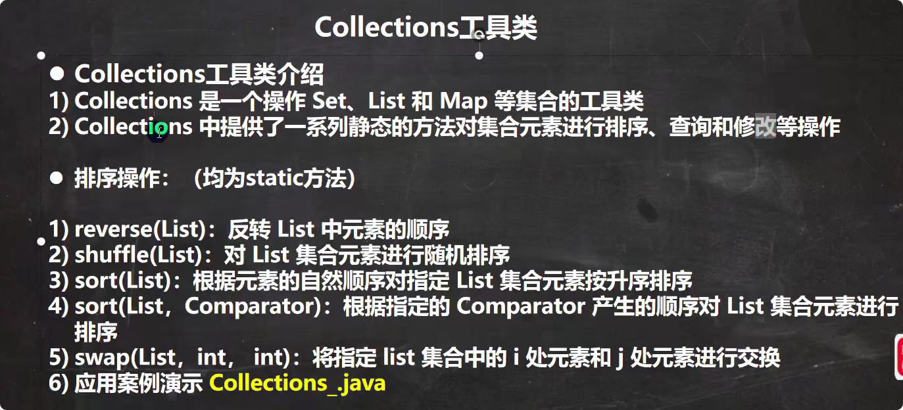

# Collection工具类
## 介绍：
1. 是一个操作Set，List和Map等集合的工具类
2. 提供了一系列静态方法对集合的元素进行排序，查询和修改等操作

## 排序操作
1. reverse(List)
2. shuffle(List):随机排序
3. sort(List):根据元素发的自然顺序对指定的List集合元素按照升序排序
4. sort(List,Comparator):根据指定的Comparator产生的顺序对List集合元素进行排序
5. swap(List,int,int):将指定的i处和j处的元素进行交换

## 查找，替换
1. Object max(Collection):根据元素的自然顺序排序，返回给的集合中的最大元素
2. Object max(Collection Comparator):根据Comparator指定顺序排序，返回指定集合中的最大元素
3. Object min(Collection)
4. Object min(Collection,Comparator)
5. int frequency(Collection, Object):返回指定集合中指定元素的出现次数
6. void copy(List dest,List src):将src中的内容复制到dest中
7. boolean replaceAll(List list,Object oldVal,Object newVal):使用新值替换所有旧值