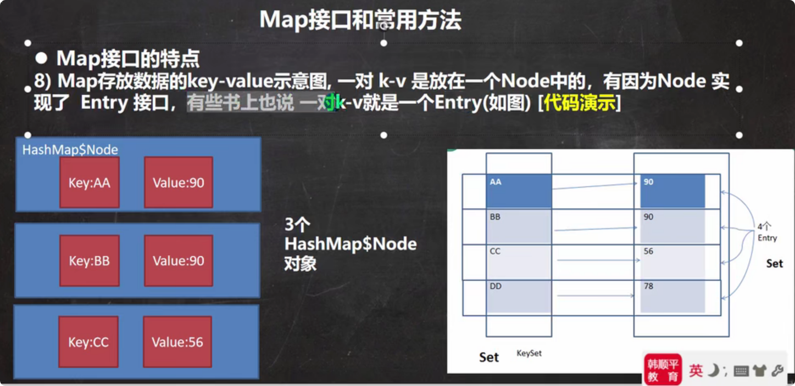
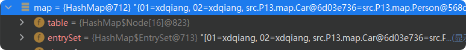
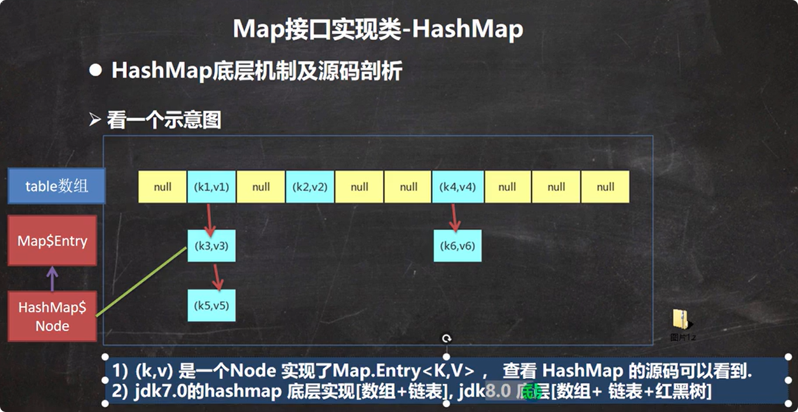
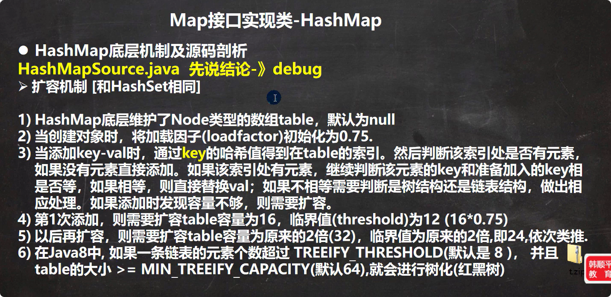
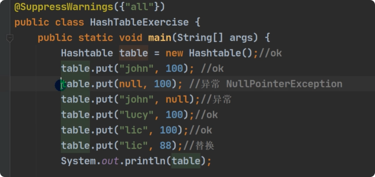
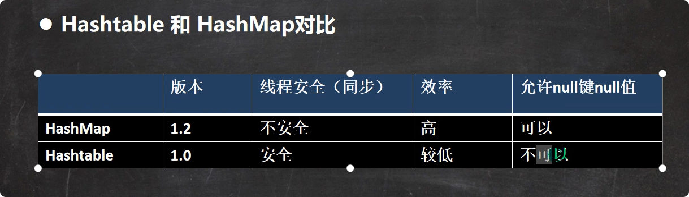

# Map特点说明
Map存储的是键值对。（其实Set存储的也是的键值对，只不过value存储的是默认值PRENSENT）
1. Map与Collection并列存在。用于保存具有映射关系的数据：key-value
2. Map中的Key和Value可以是任何引用类型的数据，会封装到HashMap$Node对象中
3. Map中的Key不允许重复
4. Map中的Value可以重复
5. Map的Key可以为null，value也可以为null。只能有一个Key为null，可以有多个value为null
6. 常用String类作为Map的Key
7. Key和Value之间存在单向的一对一关系，即通过指定的Key总能找到对应的value
8. Map存放数据的key-value示意图，一对k-v是放在一个Node中的，又因为Node实现了Entry接口有的书又称一对k-v就是一个Entry。因为Entry提供了getKey(),getValue()方法)

把table中的节点地址封装在Entry然后存储在EntrySet中

# HashMap小节
1. Map接口的常用实现类：HashMap,HashTable,Properties
2. HashMap是Map接口使用频率最高的实现类
3. HashMap是以Key-Value对的方式存储数据
4. Key不能重复但是Key可以重复
5. 相同的Key会发生覆盖
6. 与HashSet一样，不保证映射顺序，底层是通过hash表的方式存储。
7. HashMap没有实现同步，所以是线程不安全的。

# HashMap底层机制

# HashTable的基本介绍
1. 存放元素的是键值对：K-V
2. HashTable的键和值都不能为null，否则会抛出NullPointException
3. HashTable和HashMap的使用方法基本上一样
4. HashTable是线程安全的，HashMap是线程不安全的
5. hashtable底层是一个数组hashtable$Entry[],初始化大小为11
6. threshold = 8 = 11*0.75  `int newCapacity = (oldCapacity << 1) + 1;`

实例：

# hashmap和hashtable对比
