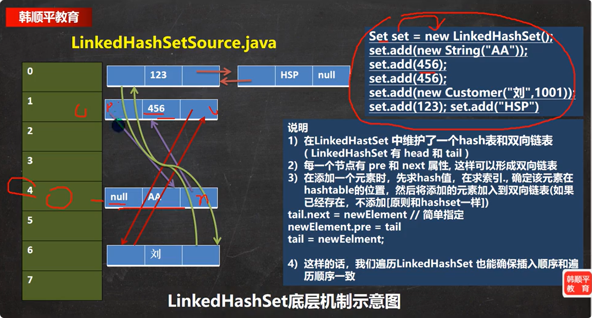

# LinkedHashSet说明
1. LinkedHashSet是HashSet的子类
2. LinkedHashSet底层是一个LinkedHashMap，底层维护了一个数组+双向链表(底层是LinkedHashMap(是LinkedHashMap的子类)，维护了一个数组(HashMap$Node)，数组中保存的是LinkedHashMap$Entry(LinkedHashMap$Entry与HashMap$Node有继承或实现关系))
3. LinkedHashSet根据元素的hashCode值来决定元素的存储位置，同时用链表维护元素的次序，这使得元素看起来是以插入顺序保的
4. LinkedHashSet不允许添加重复元素


# 数组中存放的元素
LinkedHashSet底层是LinkedHashMap(是LinkedHashMap的子类)，维护了一个数组(HashMap$Node)，数组中保存的是LinkedHashMap$Entry (LinkedHashMap$Entry与HashMap$Node有继承或实现关系)
```java
    static class Entry<K,V> extends HashMap.Node<K,V> {//Node是HashMap是一个静态内部类
        Entry<K,V> before, after;
        Entry(int hash, K key, V value, Node<K,V> next) {
            super(hash, key, value, next);
        }
    }
```