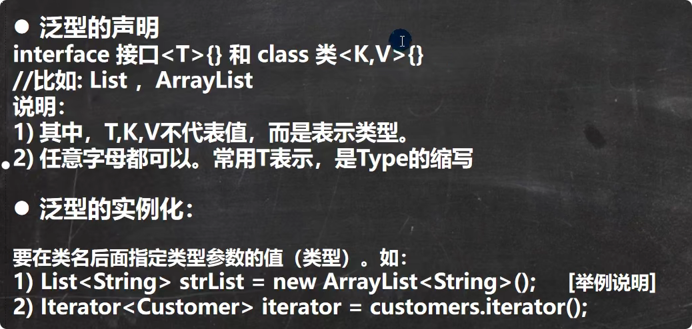
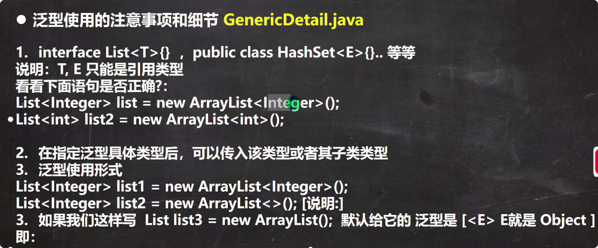

# 传统方法
1. 不能对加入到集合中的数据类型进行约束（不安全）
2. 遍历的时候需要对数据进行转型，如果集合中的数据量较大会影响效率。
# 泛型特点
1. 编译时检查数据类型，提高安全性
2. 减少类型转换次数，提高效率
# 泛型介绍
1. 泛型又称参数化类型，是jfk5.0出现的新特性，解决数据类型的安全性问题.
2. 在类声明或实例化时只要指定好具体的类型即可。
3. Java泛型可以保证如果程序在编译时没有发出警告，运行时就不会产生ClassCastException异常。同时代码更加简洁健壮
4. 泛型的作用是：可以在类申明时通过一个标识表示类中某个属性的类型，或者时某个方法的返回值的类型，或者是参数类型。
# 泛型的语法


# 自定义泛型类
基本语法：
```java
class Person<T,R,K>{//可以有多个泛型
    
}
```
注意：
1. 普通成员可以使用泛型（属性，方法）
2. 使用泛型的数组不能初始化，因为不知道数据具体类型，不知道应该开辟多大空间
3. **静态方法中不能使用类的泛型**因为静态方法是与类相关的，类加载对象还未创建，没创建对象时泛型还未确定具体类型
4. 泛型类的类型是在创建对象时确定的（因为创建对象时，需要指定确定类型）
5. 如果在创建对象时，没有指定类型，默认为Object
# 自定义泛型接口
基本语法：
```java
interface i1<T,R,M>{}
```
注意：
1. 接口中，静态成员(属性是public static final)也不能使用泛型
2. 泛型接口的类型，在继承接口或者实现接口时确定
3. 如果没有指定类型，则默认时Object

# 自定义泛型方法
语法：
```java
class A{

    public <T,R> int method(){

    }
}
```
注意：
1. 泛型方法，可以定义在普通类中，也可以定义在泛型类中。
2. 当泛型方法被调用时，类型会确定：当调用方法时传递参数时，确定T和R的类型。
3. public void eat(E e){},修饰符后没有<T,R>的方法不是泛型方法，而只是使用了泛型。
# 泛型的继承和通配符
1. 泛型不具有继承性。
2. <?>:支持任意泛型类型。
3. <? extends A>: 支持A类以及A类的子类，规定了泛型的上限。
4. <? super A>:支持A类以及A类的父类，不限与直接父类，规定了泛型的下限。
