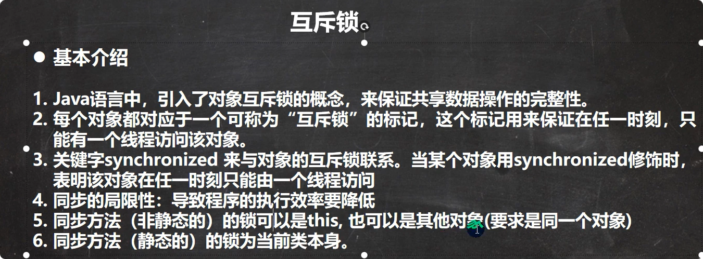
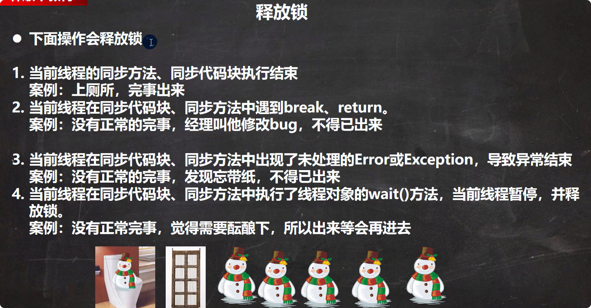

# 1.线程的基本使用
1. 基础Thread类（Thread实现了Runnable接口），重写run()方法（这个方法来自Runnable接口）
    
    
2. 实现Runnable接口，重写run()方法。（把对象放入Thread中，//静态代理类（一个对象没有start方法，但是可以依靠Rannable的start方法执行））
   
3. 在主方法中执行start()方法创建线程。
    

# 2.线程启动流程

# 3.可以在终端执行jconsole监控线程执行情况

注意：主线程执行结束后，线程还可以继续执行。**当所有线程执行完毕后进程才会结束**。
# 4.继承Thread和实现Runnable的区别

# 5.线程常用方法第一组

注意事项：

# 6.线程常用方法第二组

# 7.用户线程和守护线程
1. 用户线程：也叫工作线程，当线程的任务执行完毕或者通知方式结束
2. 守护线程：一般是为工作线程服务的，当所有的用户线程结束，守护线程自动结束`myThread.setDeamon(true)`
3. 常见的守护线程：垃圾回收机制
# 线程生命周期

# 线程同步机制

## 实现同步的方法1：Synchronized
1. 同步代码块
```
  synchronized (object){  //得到对象的锁才能操作同步代码
    //需要被同步代码
}
```
2. 放在方法声明中，表示整个方法为同步方法
```
public synchronized void m(String name){
    //需要同步的代码
}
```


注意事项和细节
1. 同步方法如果没有使用static修饰：默认锁对象为this
2. 如果同步方法使用static修饰：默认锁对象：当前类.class
3. 要保证加锁对象是同一个

## 释放锁
1. 当前线程的同步方法，同步代码执行结束
2. 当前线程在同步代码块，同步方法中遇到break，return。
3. 当前线程在同步代码块，同步方法中出现了未处理的Error或Exception导致异常结束
4. 当前线程在同步代码块，同步方法中执行了线程对象的wait()方法，当前线程暂停会释放锁



## 不会释放锁
1. 线程执行同步代码块或同步方法时，程序调用Thread,sleep(),Thread.yield()方法暂停当前线程执行但是不会释放锁
2. 线程执行同步代码块时，其他线程调用了该线程的suspend()方法将该线程挂起，该线程不会释放锁。（应避免使用suspend()和resume()来控制线程）