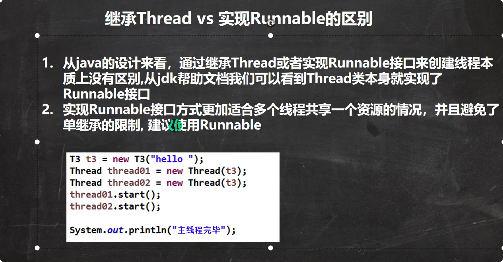

# 1.线程的基本使用
1. 基础Thread类（Thread实现了Runnable接口），重写run()方法（这个方法来自Runnable接口）
    
    
2. 实现Runnable接口，重写run()方法。（把对象放入Thread中，//静态代理类（一个对象没有start方法，但是可以依靠Rannable的start方法执行））
   
3. 在主方法中执行start()方法创建线程。
    

# 2.线程启动流程

# 3.可以在终端执行jconsole监控线程执行情况

注意：主线程执行结束后，线程还可以继续执行。**当所有线程执行完毕后进程才会结束**。
# 4.继承Thread和实现Runnable的区别

# 5.线程常用方法第一组

注意事项：

# 6.线程常用方法第二组

# 7.用户线程和守护线程
1. 用户线程：也叫工作线程，当线程的任务执行完毕或者通知方式结束
2. 守护线程：一般是为工作线程服务的，当所有的用户线程结束，守护线程自动结束`myThread.setDeamon(true)`
3. 常见的守护线程：垃圾回收机制
# 线程生命周期

# 线程同步机制

