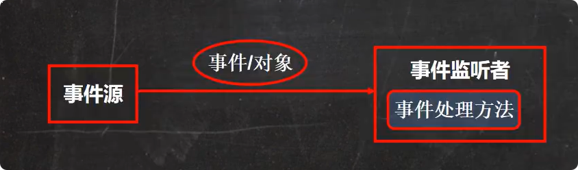
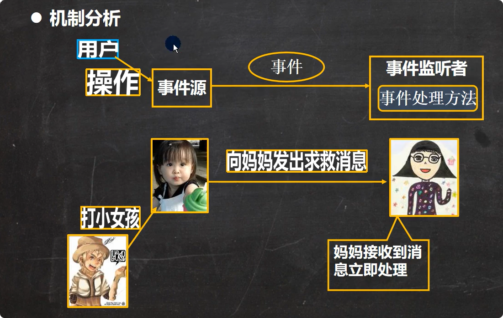
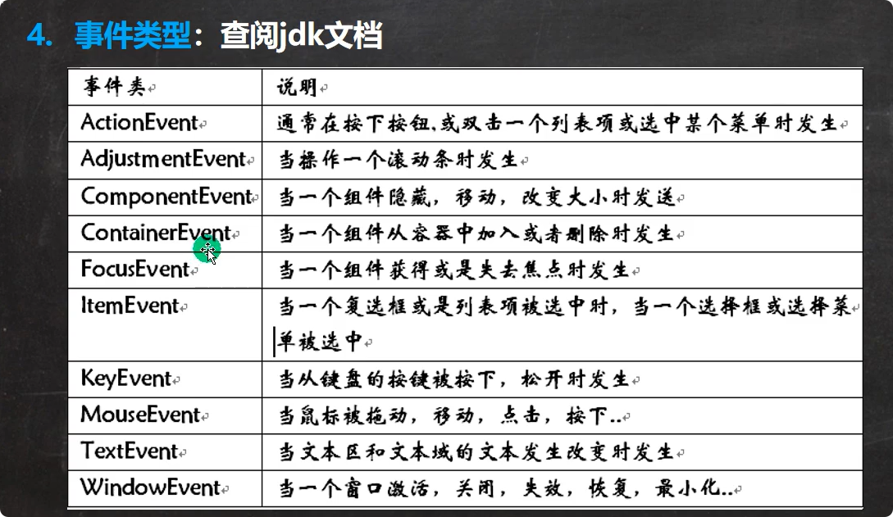
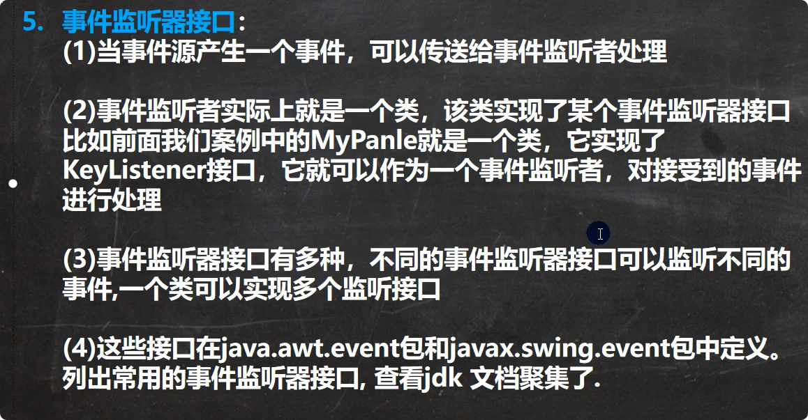

# java事件处理机制
## 基本说明
Java事件处理是采用”委派事件模型“。当事件发生时，产生事件的对象会把此信息传递给事件监听者处理，这里的信息是指`java.awt.event`事件类库里某个类所创建的对象，把它称为"事件的对象"

## 名词说明
1. 事件源：是一个产生事件的对象，比如按钮，窗口等。
2. 事件：是承载事件源状态改变时的对象，比如当键盘事件，鼠标事件，窗口事件等等，会产生一个事件对象，该对象保存着当前事件很多信息，比如KeyEvent对象有含义被按下键的code值，java.awt.event包和Javax.swing.event包中定义了各种事件的类型

## 事件种类

## 事件监听接口（接收并处理事件）
