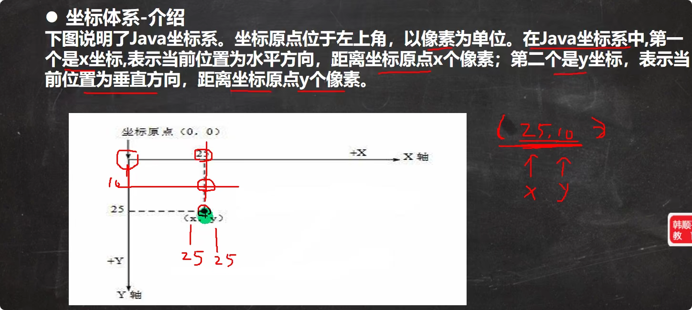
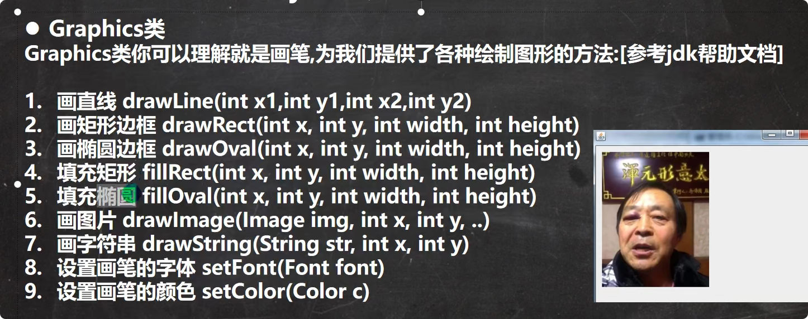

# java坐标体系

# 绘图原理
Component类提供了两个和绘图相关最重要的方法：
1. paint(Graphics g)绘制组件的外观
2. repaint()刷新组件的外观

当组件第一次在屏幕显示的时候，程序会自动调用paint()方法来绘制组件<br>
在以下情况下paint()会被调用：
1. 窗口最小化，再最大化
2. 窗口的大小发生变化
3. repaint()函数被调用

# 使用实例

```java
package src.tankgame.notes.draw;

import javax.swing.*;
import java.awt.*;

/*
 *   @author : xdqiang
 */
public class DrawCircle extends JFrame {//JFrame对应的窗口，可以理解为画框
    //定义一个面板
    private MyPanel mp = null;

    public DrawCircle() {
        mp = new MyPanel();
        this.add(mp);
        this.setSize(400, 300);
        this.setVisible(true);//可以显示
    }

    public static void main(String[] args) {
        new DrawCircle();


    }
}

//1.定义一个面板MyPanel,继承JPanel类。
class MyPanel extends JPanel {
    @Override
    public void paint(Graphics g) {//Graphics可以理解为画笔，提供了很多绘图的方法
        super.paint(g);//调用父类的方法完成初始化
        System.out.println("调用了paint()");
        g.drawOval(10, 10, 100, 100);
    }
}

```
# 绘图方法
